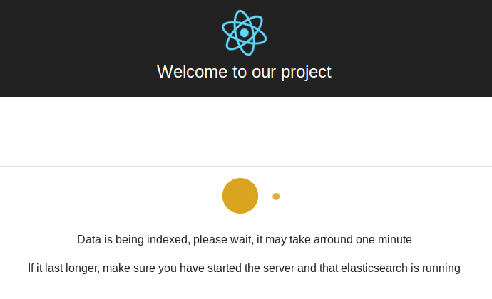
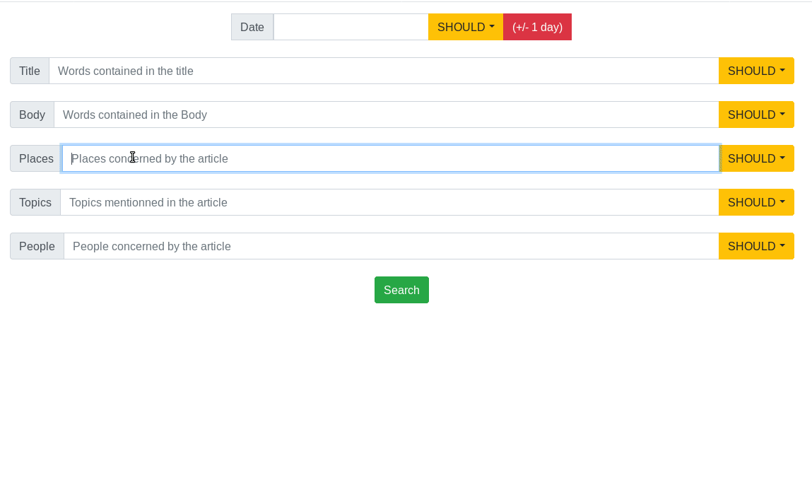
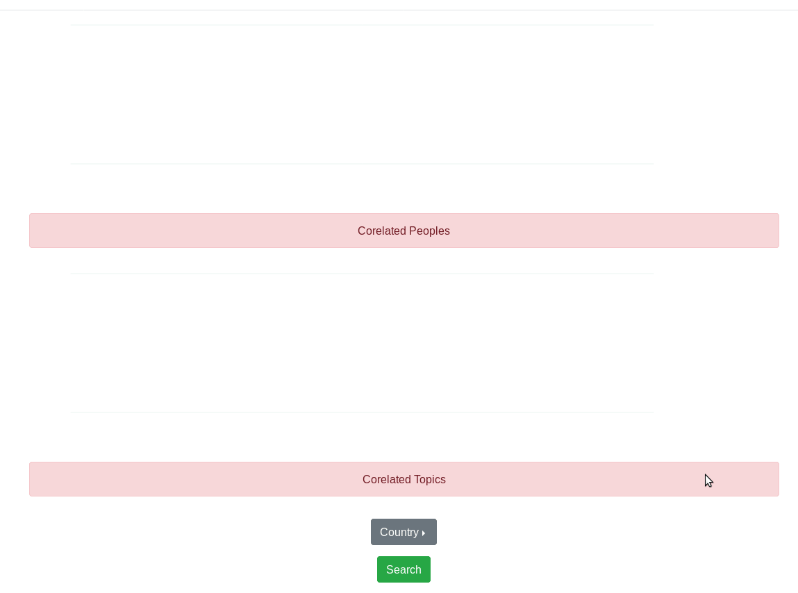

# NoSQLProject

<p align="center">
    
</p>

This project is about creating an application on the [Reuters NoSQL database](server/reuters_elastic.json). We have chosen to create a web application with Node.js and React.js and to use Elasticsearch. 

This application has:
* Connection features;
* Dataset Importation;
* Minimum 3 different interactions in order to show the result of queries (preformatted queries)
* A form to try queries (maybe with params) on the dataset

## Summary
***

* [Usage](#usage)
* [Search Page](#search-page)
* [Analysis Page](#analysis-page)
* [More Details](#more-details)

## Usage 
***

* If you do not have node.js installed in your computer, download it on https://nodejs.org/en/

* If you do not have npm installed in your computer, download it on https://www.npmjs.com/get-npm

* First, clone the project:
```sh
$ git clone https://github.com/vidjul/NoSQLProject
``` 

* Launch ElasticSearch.

* Install packages into client and server folders:
```sh
cd client
$ npm install
``` 

```sh
cd server
$ npm install
``` 

* Use the command line into the server folder:

```sh
node index.js
``` 

* Use the command line into the client folder:

```sh
npm start
``` 
The app is now starting.
When you launch the app for the first time, the screen below will be displayed.

<p align="center">
    
</p>

The dataset is being automatically imported in ElasticSearch.
When the process will be finished, you wil be able to access
to the app features.

## Search page
***

<p align="center">
    
</p>

This feature allows you to input query to search in the database.

Reuters NoSQL Database has the following parameters:
* Date
* Title 
* Body
* Places 
* Topics
* People

## Analysis page
***

<p align="center">
    
</p>

This page contains graphs depending on the search that you have done. 

## More details
***

For more details, please see the [Report](./Report.pdf). 

